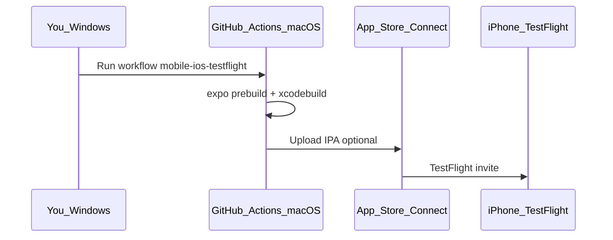

# Nexa iOS — build on GitHub Actions (no Mac, no Expo credits)

Use this when you have **Windows**, an **iPhone**, an **Apple Developer account**, and **zero Expo EAS credits**. GitHub’s **macOS runners** compile the app; you install via **TestFlight**.

Workflow file: [`.github/workflows/mobile-ios-testflight.yml`](../.github/workflows/mobile-ios-testflight.yml)  
Build script: [`mobile/scripts/gha-ios-build.sh`](../mobile/scripts/gha-ios-build.sh)  
Release checklist: [`mobile/RELEASE_CHECKLIST.md`](../mobile/RELEASE_CHECKLIST.md)

---

## What you need to do next (checklist)

Do these **in order** before running the workflow:

- [ ] **1. App Store Connect** — Create app with bundle ID **`com.loopc.nexa`** (name: Nexa)
- [ ] **2. Distribution certificate** — Create `.p12` (OpenSSL on Windows — section below)
- [ ] **3. Provisioning profile** — App Store profile named **`Nexa App Store`** for `com.loopc.nexa`
- [ ] **4. App Store Connect API key** — Download `.p8`, note Key ID + Issuer ID
- [ ] **5. GitHub secrets** — Add all 8 secrets from the table below (repo Settings → Secrets → Actions)  
  Verify: `npm run check:mobile-release-secrets` (from repo root; needs `gh auth login`)
- [ ] **6. Push / merge** this repo so the workflow file is on `main`
- [ ] **7. Run workflow** — GitHub → Actions → **Mobile iOS (GitHub macOS)** → Run workflow (~20–40 min)
- [ ] **8. iPhone** — Install **TestFlight** → accept invite → install Nexa → test MG / CG / LoopC login

---

## Overview



| Step | Where | What |
|------|--------|------|
| 1 | Apple Developer web | Certificates + App Store profile + API key |
| 2 | GitHub repo secrets | Store signing + upload credentials |
| 3 | GitHub Actions | Build IPA on cloud Mac (~20–40 min) |
| 4 | iPhone | TestFlight → install Nexa |

**Costs:** Apple Developer $99/yr. GitHub Actions macOS minutes (10× multiplier on free plans). **No Expo credits.**

---

## One-time Apple setup

### 1. App Store Connect app

1. [App Store Connect](https://appstoreconnect.apple.com) → **Apps** → **+** → New App  
2. **Bundle ID:** `com.loopc.nexa` (must match [`mobile/app.config.ts`](../mobile/app.config.ts))  
3. **Name:** Nexa  

### 2. Distribution certificate (.p12) — from Windows (no Mac)

You can create a certificate without Xcode:

```powershell
# 1. Generate private key + CSR (run in a folder you control)
openssl genrsa -out nexa-ios.key 2048
openssl req -new -key nexa-ios.key -out nexa-ios.csr -subj "/CN=Nexa Distribution/O=Your Company/C=US"

# 2. Apple Developer → Certificates → + → Apple Distribution → upload nexa-ios.csr → download distribution.cer

# 3. Convert to .p12 (set a strong password — you will store it in GitHub secrets)
openssl x509 -inform DER -in distribution.cer -out distribution.pem
openssl pkcs12 -export -out nexa-distribution.p12 -inkey nexa-ios.key -in distribution.pem
```

Keep `nexa-distribution.p12` and its password safe. **Do not commit** to git.

### 3. App Store provisioning profile

1. [Developer portal](https://developer.apple.com/account/resources/profiles/list) → **Profiles** → **+**  
2. **App Store Connect** (distribution)  
3. App ID: `com.loopc.nexa`  
4. Select your **Apple Distribution** certificate  
5. Name profile: **`Nexa App Store`** (must match [`mobile/scripts/ios-export-options.plist`](../mobile/scripts/ios-export-options.plist))  
6. Download `Nexa_App_Store.mobileprovision` (name may vary; rename content is fine)

### 4. App Store Connect API key (for TestFlight upload from CI)

1. App Store Connect → **Users and Access** → **Integrations** → **App Store Connect API**  
2. **+** → name e.g. `github-nexa-ci` → **Admin** or **App Manager**  
3. Download **`.p8`** once (cannot re-download)  
4. Note **Issuer ID** and **Key ID**

---

## GitHub repository secrets

Repo → **Settings** → **Secrets and variables** → **Actions** → **New repository secret**

| Secret | Value |
|--------|--------|
| `APPLE_TEAM_ID` | 10-character Team ID (Membership details in Apple Developer) |
| `IOS_BUNDLE_ID` | `com.loopc.nexa` |
| `BUILD_CERTIFICATE_BASE64` | Base64 of `.p12`: `[Convert]::ToBase64String([IO.File]::ReadAllBytes("nexa-distribution.p12"))` in PowerShell |
| `P12_PASSWORD` | Password you set when exporting `.p12` |
| `BUILD_PROVISION_PROFILE_BASE64` | Base64 of `.mobileprovision` file |
| `KEYCHAIN_PASSWORD` | Any random string (e.g. `ci-keychain-2026`) — temp CI keychain only |
| `APP_STORE_CONNECT_API_KEY_ID` | Key ID from step 4 |
| `APP_STORE_CONNECT_ISSUER_ID` | Issuer ID |
| `APP_STORE_CONNECT_API_KEY` | Full contents of the `.p8` file |

Optional Android CI signing (Play upload AAB from **Mobile Android bundle** workflow):

| Secret | Value |
|--------|--------|
| `ANDROID_KEYSTORE_BASE64` | Base64 of upload `.jks` / `.keystore` |
| `ANDROID_KEYSTORE_PASSWORD` | Keystore password |
| `ANDROID_KEY_ALIAS` | Key alias |

Optional: set repository variable `IOS_UPLOAD_TESTFLIGHT` = `true` when all three API secrets are configured.

---

## Files to add to the repo (implementation)

When Agent mode applies the plan, these files are created:

### `.github/workflows/mobile-ios-testflight.yml`

Manual trigger (`workflow_dispatch`). Builds IPA and optionally uploads to TestFlight.

### `mobile/scripts/gha-ios-build.sh`

Runs `expo prebuild`, `pod install`, `xcodebuild archive` + export.

### `mobile/scripts/ios-export-options.plist`

Export method `app-store`, bundle `com.loopc.nexa`, profile name `Nexa App Store`.

---

## How to run (from Windows)

1. Push `main` with workflow files merged  
2. GitHub → **Actions** → **Mobile iOS (GitHub macOS)** → **Run workflow**  
3. Wait for green check (~20–40 minutes first time)  
4. **Artifacts:** download `nexa-ios-ipa` if you skipped TestFlight upload  
5. **TestFlight:** App Store Connect → your app → **TestFlight** → add internal testers → open **TestFlight** on iPhone → install  

### First TestFlight install on iPhone

1. Install **TestFlight** from App Store  
2. Accept email invite or open public link from App Store Connect  
3. Install **Nexa**  
4. Test: login **CG** / **MG** / **LoopC**, logout between tenants, Home metal rates, push  

---

## GitHub Actions minutes

- `macos-latest` uses **10×** minute multiplier on GitHub Free for private repos  
- One iOS build ≈ **20–40** wall-clock minutes ≈ **200–400** billed minutes  
- Plan builds; don’t run on every commit — use `workflow_dispatch` only  

---

## Troubleshooting

| Problem | Fix |
|---------|-----|
| `No signing certificate` | Re-check `BUILD_CERTIFICATE_BASE64` + `P12_PASSWORD` |
| Provisioning profile mismatch | Profile name must be `Nexa App Store` in portal and plist; bundle ID `com.loopc.nexa` |
| `pod install` fails | Re-run workflow; macOS runner network glitch |
| TestFlight upload fails | Verify API key has App Manager role; app record exists in ASC |
| Expo credits | Not used — this path ignores EAS entirely |

---

## When Expo credits return

You may optionally use `npm run mobile:build:ios` (EAS) instead. Until then, **this GitHub workflow is the supported path** for Windows + iPhone without a Mac.

---

## Related

- [MOBILE-NO-EAS.md](./MOBILE-NO-EAS.md)  
- [MOBILE-ANDROID-LOCAL-BUILD.md](./MOBILE-ANDROID-LOCAL-BUILD.md)  
- [mobile/STORE_RELEASE.md](../mobile/STORE_RELEASE.md) (EAS path)  
- [PUSH-NOTIFICATIONS.md](./PUSH-NOTIFICATIONS.md) (APNs via Expo push token)

Implementation files in this repo:

- [`.github/workflows/mobile-ios-testflight.yml`](../.github/workflows/mobile-ios-testflight.yml)
- [`mobile/scripts/gha-ios-build.sh`](../mobile/scripts/gha-ios-build.sh)
- [`mobile/scripts/ios-export-options.plist`](../mobile/scripts/ios-export-options.plist)
